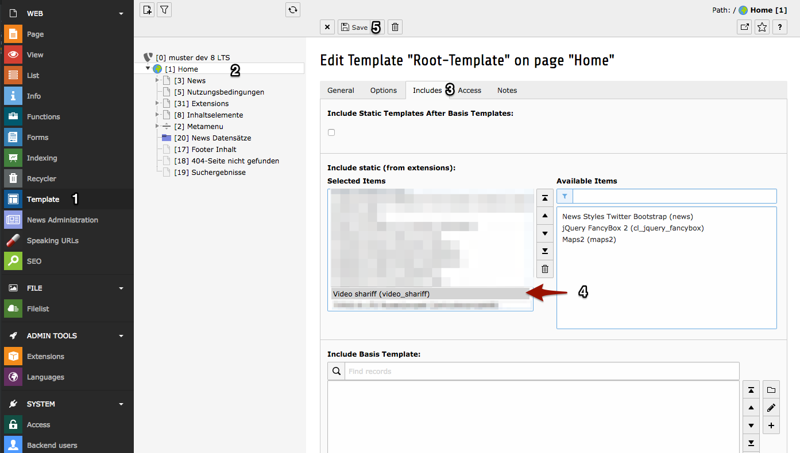

.. ==================================================
.. FOR YOUR INFORMATION
.. --------------------------------------------------
.. -*- coding: utf-8 -*- with BOM.

.. include:: ../Includes.txt

.. _admin-manual:

Administrator Manual
====================

The usage of this extension is that simple. You only need to add the static template "video_shariff" to your template and then clearing the cache.

Override preview image text / add additional languages
------------------------------------------------------

You can override the default preview image text and adding new languages via TypoScript setup.

.. code-block:: typoscript

   plugin.tx_videoshariff._LOCAL_LANG.default.preview\.text = I am a custom preview text...
   plugin.tx_videoshariff._LOCAL_LANG.de.preview\.text = Ich bin ein angepasster Vorschautext...
