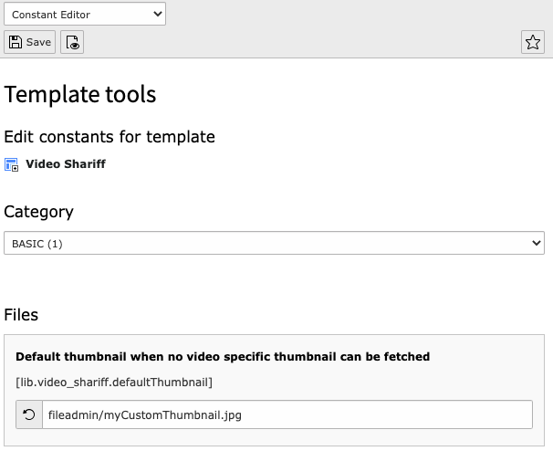

..  include:: /Includes.rst.txt

..  _admin-manual:

====================
Administrator Manual
====================

The usage of this extension is that simple. You only need to add the static
template "video_shariff" to your template and then clearing the cache.

..  figure:: ../Images/BasicConfiguration.png
    :width: 300px
    :alt: Configuration

Override preview image text / add additional languages
======================================================

You can override the default preview image text and adding new languages via TypoScript setup.

..  code-block:: typoscript

    plugin.tx_videoshariff._LOCAL_LANG.default.preview\.text = I am a custom preview text...
    plugin.tx_videoshariff._LOCAL_LANG.de.preview\.text = Ich bin ein angepasster Vorschautext...

Use a custom default thumbnail
==============================

The default thumbnail is rendered when no video specific thumbnail can be fetched. You can use your own
thumbnail using the constant editor or TypoScript.

Using constant editor
---------------------

Template > Constant Editor > Basic

Using TypoScript setup or constants
-----------------------------------

..  code-block:: typoscript

    lib.video_shariff.defaultThumbnail = fileadmin/myCustomThumbnail.jpg
